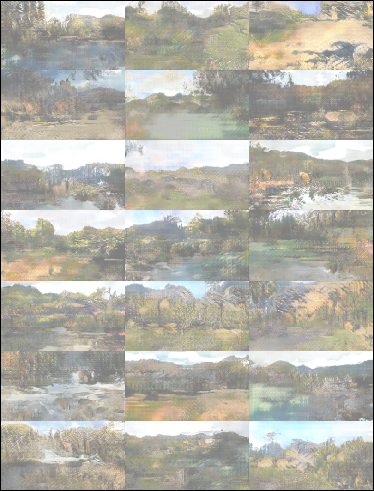

# Generating and Manipulating Images with GANs

A team project as part of the Computer Science Master's program at the University of Ulm.

## Project Description

The scope of this project was to learn about Generative Adversarial Networks (GANs). Therefore the main task was to generate landscape images starting from a vector of random numbers. Furthermore we tried to manipulate images. The first intention for manipulation was to change the daytime of landscape images (e.g. image at day to night). Due to a lack of available training data this project goal had to be changed to transformations from dog to cat and reverse. For that task the Cycle GAN architecture [1] was implemented. The results of the manipulation task were not satisfying for the available data and limited private computing power.

### Generation of Landscape Images

For image generation two GAN architectures were used: SNDCGAN [2] and Wasserstein GAN [3]. Both networks were trained on images from the Open Images Dataset v4 [4]. The SNDCGAN was more successful than the Wasserstein GAN and examples of generated landscape images from the SNDCGAN are shown below. They have a very low resolution but elements of landscapes are visible.

My main task was the implementation and finetuning of the SNDCGAN. Additionally, I worked on the preparation of the Open Images v4 (consisting of around 26.000 images) to create an appropriate dataset. In order to achive better results on our limited hardware we reduced the amount of images to 7.000 by keeping just images with good quality. 

For training of the SNDCGAN a GeForce GTX 1660 Super Gaming X from MSI was used with 6 GB graphics memory. In order to apply image batches for learning, a low input resolution of 256x144 pixels had to be used. Thereby was a trade-off between a higher resolution with more information for learning and a higher batch size causing a better generalization.

In the given setting the results of the SNDCGAN were satisfying.



<br><br>
<span style="font-size:x-small">
    [1] Jun-Yan Zhu et al. „Unpaired Image-to-Image Translation using Cycle-Consistent Adversarial Networks“. In: Proceedings of the IEEE international conference on computer vision. 2017, S. 2223– 2232.<br>
    [2] Takeru Miyato et al. „Spectral Normalization for Generative Adversarial Networks“. In: arXiv preprint arXiv:1802.05957 (2018).<br>
    [3] Martin Arjovsky, Soumith Chintala und Léon Bottou. „Wasserstein GAN“. In: International conference on machine learning. PMLR. 2017, S. 214–223.<br>
    [4] Alina Kuznetsova et al. „The Open Images Dataset V4: Unified image classification, object detection, and visual relationship detection at scale“. In: arXiv:1811.00982 (2018). arXiv: 1811.00982.
</span>

## Project Structure

```
├── README.md
│
├── cyclegan                        <- GAN for image manipulation 
│
├── dataset_creator                 <- scripts for downloading and preparing training data
│   ├── download_scripts        
│   ├── preprocess_scripts   
│   │   └── img_annotation_tool     <- extern image annotation tool 
│   └── results_open_images         <- results of labeling task for OpenImages_v4 dataset
│
│── sndcgan                         <- GAN for image generation
│   └── dataset
│
└── wasserstein_gan                 <- GAN for image generation
```
